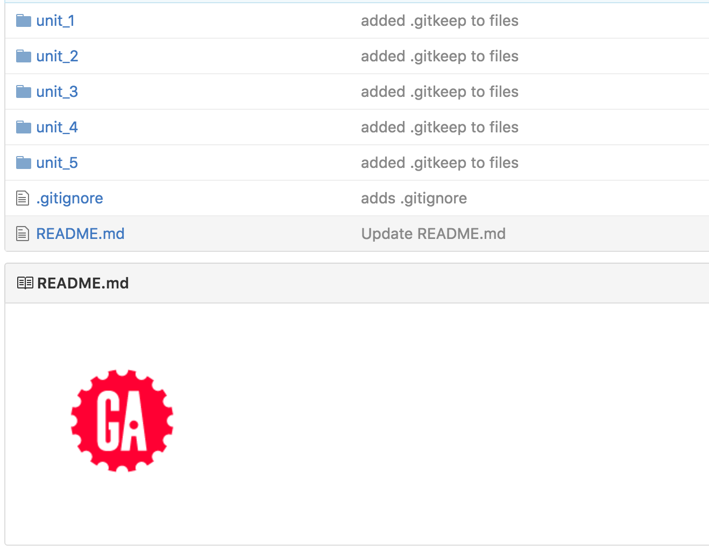
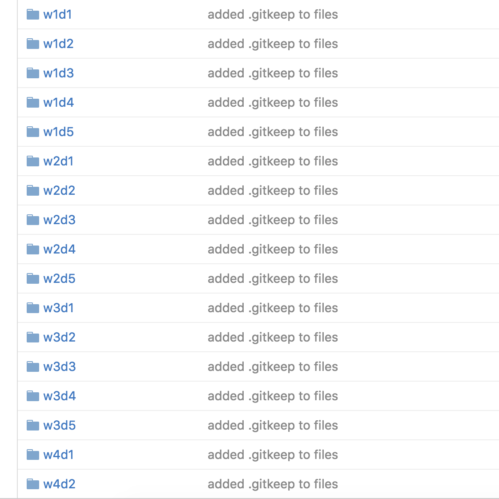
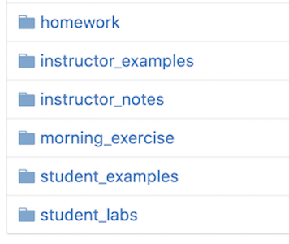

# WDI-Folder-Script

### To run the script
- Clone the `wdiFolderScript` file or paste the code from that file into a new file on your local machine.
- Navigate to the folder where you would like to create the WDI folder structure. From inside the root of that folder, type in the absolute path to the location of the script file.
Ex:`new_folder:$ ~/Desktop/wdiFolderScript`

### This script will produce the following:

1) README.md file with GA logo

2) .gitignore file

3) Unit Folders
- Directories for unit_1 through unit 5
  

 
 
4) Week and Day Folders
 - Directories for the week and days of each unit. Ex: In unit_1, there are directories for w1d1 through w5d5.
 

 
 
 Note: You can change the *weeks* that you need for each unit in the code by modifying the numbers between the `w{}` inside the specific unit's code in the following two lines:
 `mkdir unit_$unit/w{1..4}d{1..5}`
 and
 `mkdir unit_$unit/w{1..4}d{1..5}/$i`

5) Subfolders
 - Subfolders for each day. The current list of subfolders is:
  - 'homework'
  -	'instructor_notes'
  -	'instructor_examples'
  -	'morning_exercise'
  -	'student_labs'
  -	'student_examples'
  

 
 Note: You can change the names of these subfolders (or remove them), by changing the names inside the array at the beginning of the script.
